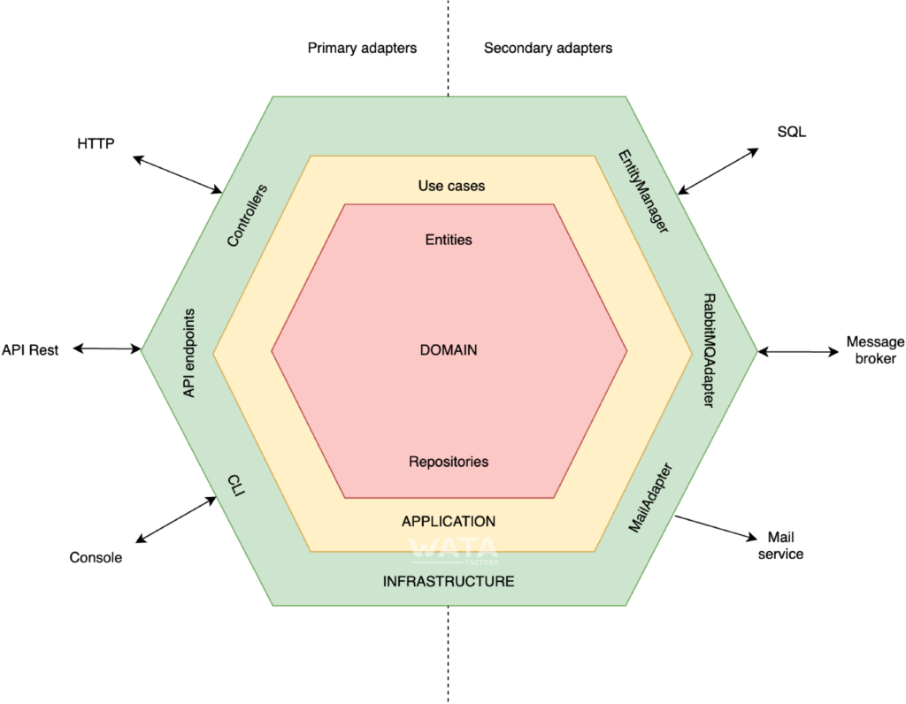

# Arquitectura hexagonal
La arquitectura hexagonal, o arquitectura de puertos y adaptadores, es un patrón arquitectónico encuadrado entre las arquitecturas limpias. Su objetivo es crear componentes de aplicación débilmente acoplados que se puedan conectar fácilmente a su entorno de software mediante puertos y adaptadores. Esto hace que los componentes sean intercambiables a cualquier nivel y facilita la automatización de pruebas.
## Principio
La arquitectura hexagonal divide un sistema en varios componentes intercambiables y débilmente acoplados. La idea principal es que la lógica de negocios no este acoplada con ningún elemento externo a esta, como ser un framework, una base de datos, etc.

## Beneficios
- **Independiente de frameworks**: El proyecto nunca dependerá de un framework externo, ya que siempre habrá una capa que abstraiga la lógica y permita cambiar los frameworks sin afectar la aplicación.
- **Testeable**: La lógica de negocios se pueden probar independientemente.
- **Independiente de la base de datos**: El dominio de la aplicación no sabe cómo está estructurada y almacenada la información.
- **Independiente de agentes externos**:La lógica de negocios no tienen conocimiento de la existencia de un agente externo.

## Estructura en capas
La arquitectura hexagonal propone describir la aplicación en varias capas. El código de cada capa describiría cómo comunicarse con las demás a través de interfaces (puertos) e implementaciones (adaptadores).

### La capa de dominio
Es la capa central del hexágono y contiene las reglas de negocio. Usualmente tiene estos componentes:

- **Servicios**: Implementan la lógica de negocio. Usan puertos (interfaces de repositorios) y clases de entidades para comunicarse con el exterior.
- **Puertos o repositorios**: Clases abstractas que indican cómo será la comunicación entre el servicio y el exterior.
- **Entidades**: Son clases de datos que encapsulan los datos utilizados por los servicios.

Esta capa no sabe cómo está estructurada, almacenada y recuperada la información del repositorio. Simplemente expone un conjunto de interfaces (puertos) que se adaptan en la capa de infraestructura para cada caso específico de implementación de esta persistencia.
### La capa de aplicación
Sobre la capa de dominio está la capa de aplicación, donde se definen los diferentes casos de uso. Al definir los casos de uso, pensamos en las interfaces que están disponibles en el hexágono de la aplicación y no en ninguna de las tecnologías disponibles que podemos usar.

### La capa de infraestructura
Esta es la capa más externa del hexágono y corresponde a las implementaciones o adaptadores de los puertos de las otras capas.

Normalmente, esta capa corresponde al framework, pero también contiene bibliotecas de terceros, SDKs o cualquier otro código que sea externo a la aplicación.

Además, esta capa contiene la integración de las clases, implementando la inyectamos de dependencia. En este caso es la carpeta Wirings
### Comunicación entre las capas
Para lograr esto, usamos la inyección de dependencias, es decir, inyectamos las dependencias en la clase en lugar de instanciarlas dentro de la clase. De esta manera, hemos desacoplado las clases de las otras capas para que dependan de una interfaz en lugar de una implementación concreta.

Entonces, lo que estamos logrando es invertir el control de la aplicación, evitando que nuestro programa dependa de una tecnología particular, permitiendo que la tecnología se adapte a los requisitos de la aplicación.

La visibilidad de los diferentes elementos es la siguiente:

**Infraestructura** -> **Aplicación** -> **Dominio**

Solo se pueden usar elementos en la dirección de la flecha. Es decir, el dominio solo puede usar sus propios elementos. La aplicación sus propios y los del dominio. La infraestructura puede usar todos.
